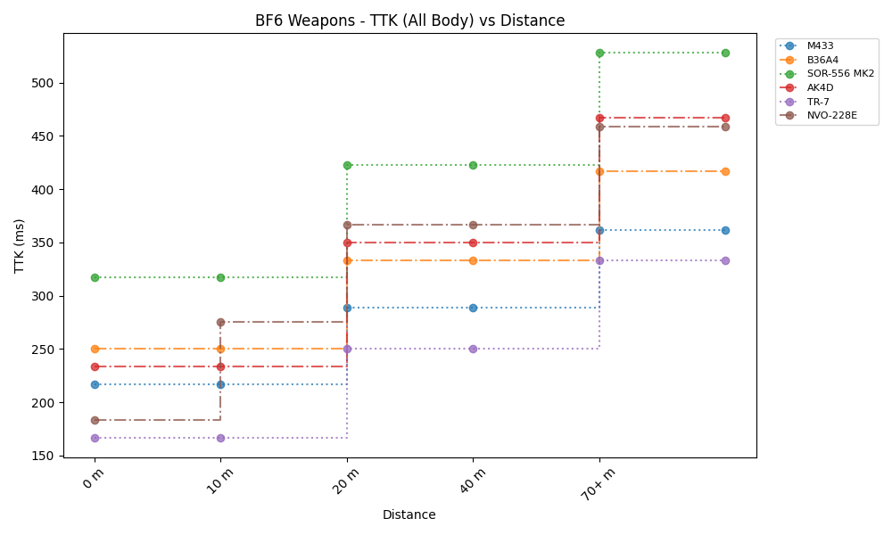
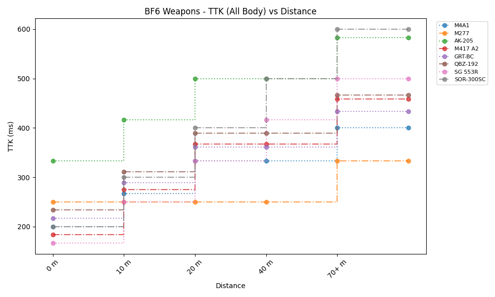
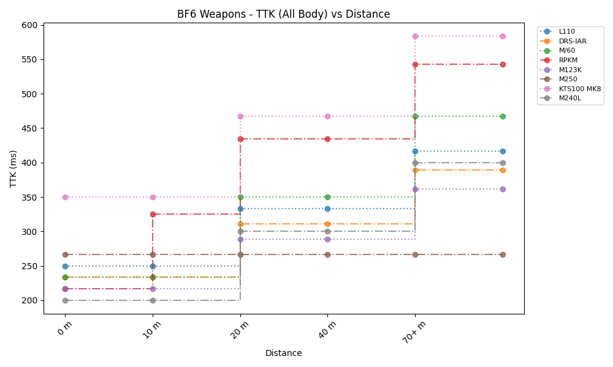
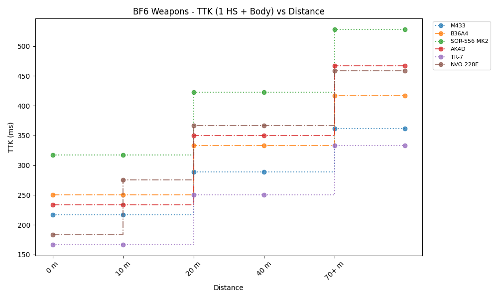
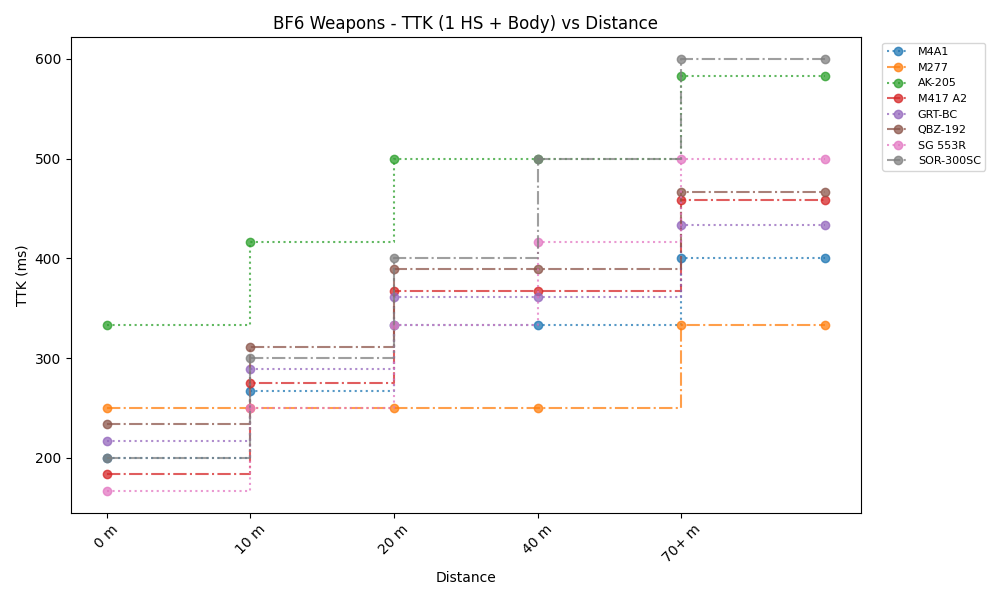
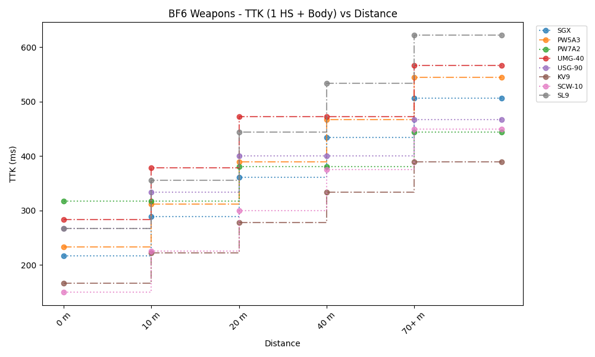

# BF6 Weapon Stats

- [Weapon Stats Database](https://docs.google.com/spreadsheets/d/1kDgbGSzzkn1EB-VunZnGB5k8NTnJVuTLPn5adP6dWXY).

**Usage:**

```powershell
python.exe .\PlotGen.py
python.exe .\PlotGen.py --class LMG --ttk Body
python.exe .\PlotGen.py --class SMG --ttk 1HS
```

**Assumptions:**

- Attachments does not modify damage falloffs.
- No more falloffs after 70+ meters.
- Weapon damage falloffs somewhat accurate, and even in case if not - weapon data still good enough to compare weapons inside this measurement system.
- The bullet's travel time does not have a significant effect on the TTK and can be ignored.
- The game does not have a mechanism where the first bullet is fired with a delay after the fire command is entered (this usually happens on submachine guns in other games). Or we assume this delay is also insignificant.

## Plots










